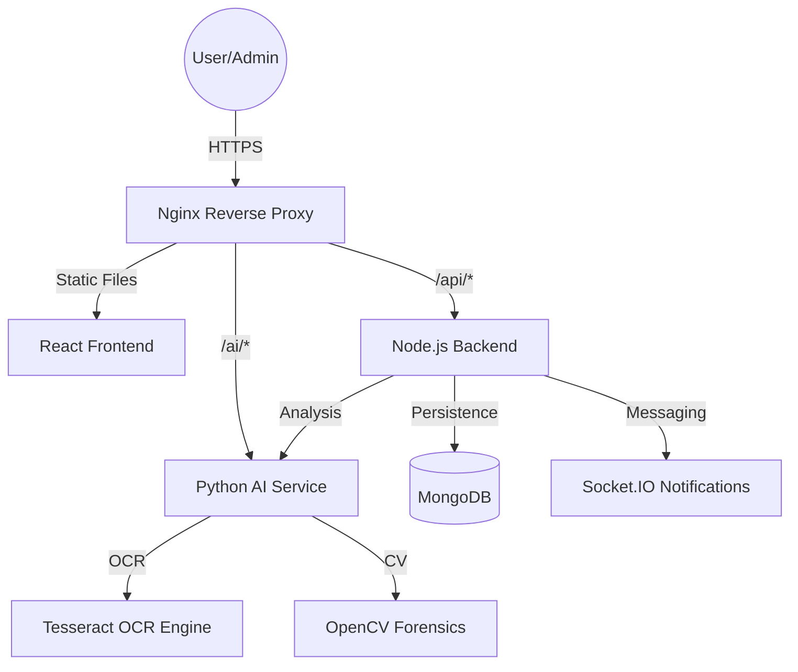

# System Architecture - Authenticity Validator

## 1. High-Level Overview
The Authenticity Validator is a microservice-based platform designed to verify the integrity and authenticity of academic certificates. It combines deterministic record matching with AI-assisted heuristic analysis to detect tampering and fraud.

## 2. Core Components

### 2.1 Frontend (React + Vite)
- **Framework:** React 18 with Vite for fast builds.
- **Styling:** Tailwind CSS for a modern, responsive UI.
- **Communication:** Axios for REST APIs and Socket.IO-client for real-time verification updates.
- **Client-side OCR:** Uses Tesseract.js for a lightweight browser-based demo mode.

### 2.2 Backend (Node.js + Express)
- **Framework:** Express.js 5.
- **Database:** MongoDB via Mongoose for flexible document storage.
- **Security:** JWT for authentication and Role-Based Access Control (RBAC).
- **Hashing Logic:**
    - `documentHash`: SHA-256 of the raw file bytes (binary integrity).
    - `certificateHash`: SHA-256 of normalized structured data (semantic integrity).
- **Integration:** Orchestrates calls to the AI Service for deep document analysis.

### 2.3 AI Service (Python + FastAPI)
- **Framework:** FastAPI for high-performance asynchronous API endpoints.
- **OCR Engine:** Pytesseract (Tesseract OCR binary) with custom preprocessing pipelines.
- **Forensics Engine:** Custom OpenCV heuristics for:
    - **ELA (Error Level Analysis):** Detecting compression inconsistencies.
    - **Noise Pattern Analysis:** Identifying localized editing artifacts.
    - **Heuristic Scoring:** Handcrafted rule-based models for anomaly and tampering scores.
- **Logic:**
    - **Deterministic Route:** Used for high-confidence OCR text.
    - **Contextual Route:** Used for low-confidence or narrative text.

## 3. Verification Logic Flow

### 3.1 Trusted Ingestion (Issuer Side)
1. **Upload:** An authorized institution admin uploads a certificate.
2. **Normalization:** The system trims, uppercases, and formats the data to ensure hash stability.
3. **Hashing:** Two hashes are generated (binary and semantic).
4. **AI Pass:** The AI service runs OCR and tampering checks to establish a baseline.
5. **Persistence:** The record is stored as a "Trusted Record" in MongoDB.

### 3.2 Candidate Validation (Verifier Side)
1. **Submission:** A verifier submits a candidate document or metadata.
2. **Hash Comparison:**
    - If `candidateHash == trustedHash` → **Verified**.
    - If `candidateID exists` but `candidateHash != trustedHash` → **Fake/Tampered**.
    - If `no record exists` → **Suspicious**.
3. **AI Analysis:** The AI service performs forensics to detect physical/digital tampering on the submitted file.

## 4. AI Model Logic
The "AI" in this system is a **hybrid heuristic-rule engine**:
- **OCR Confidence Weight (40%):** Reliability of the text extraction.
- **Tamper Score Weight (30%):** Derived from ELA and noise pattern inconsistencies.
- **Database Match (20%):** Bonus for matching a known trusted hash.
- **Anomaly Score Weight (10%):** Negative weight for formatting or contextual irregularities.

## 5. Security & Trust Model
- **RBAC:** Multiple roles (Admin, Institution Admin, University Admin, Verifier, User) ensure strict data isolation.
- **Immutable Anchoring:** (Optional) Support for EVM (Solidity) and Solana (Anchor) for public document hash registration on the blockchain.
