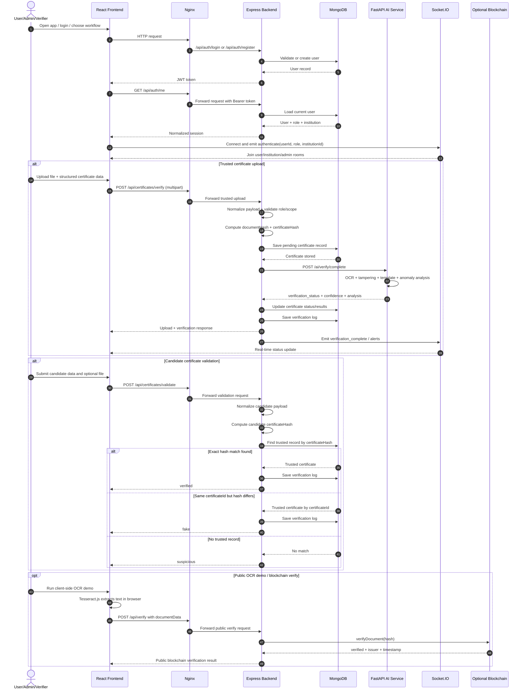
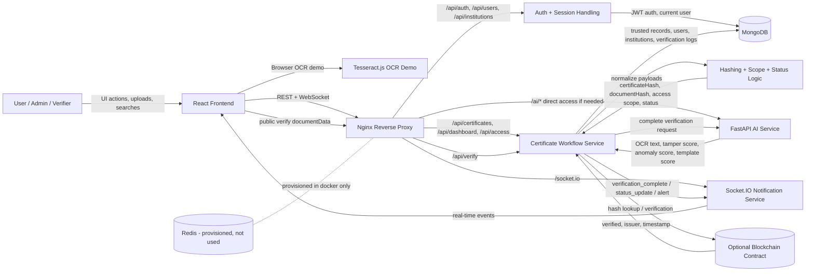
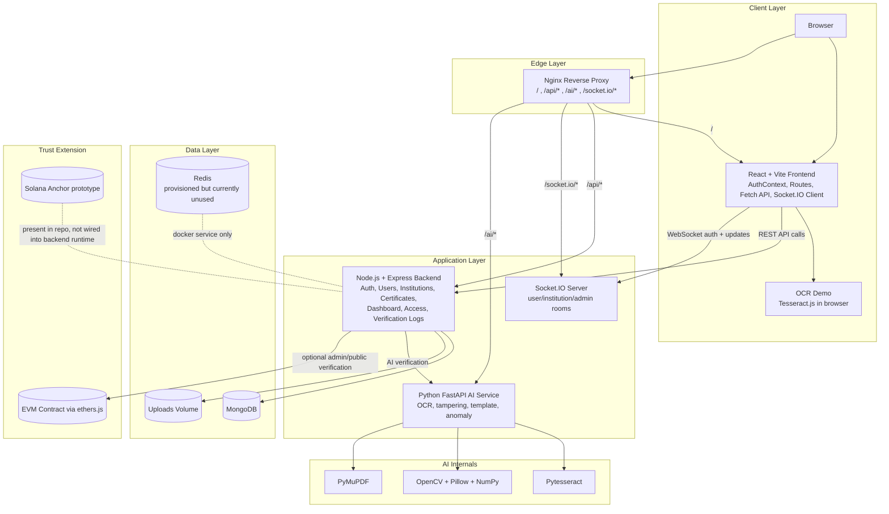

# Authenticity Validator Diagrams

These diagrams reflect the current repository structure and runtime behavior.

- Core runtime path: frontend -> nginx -> backend -> MongoDB / AI service
- Blockchain: optional extension path
- Redis: provisioned in Docker but not currently used by application logic

## Sequence Diagram

## Data Flow Diagram

## Architecture Diagram

